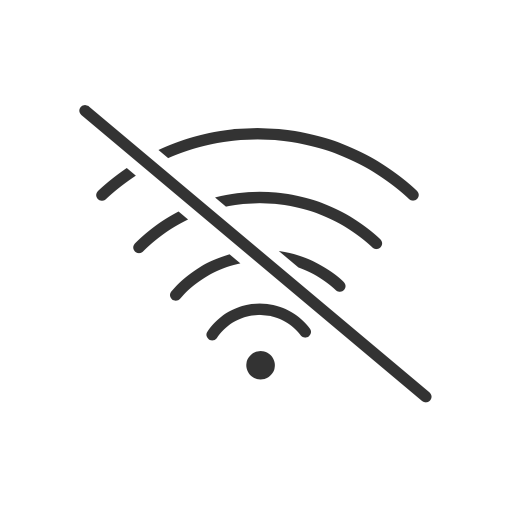

# NetworkDetector

[](https://cocoapods.org/pods/NetworkDetector)
[](https://cocoapods.org/pods/NetworkDetector)
[](https://cocoapods.org/pods/NetworkDetector)

<p align="center"></p>

## Description

NetworkDetector is a very simple iOS library that detects network changes and calls a closure or broadcasts a notification based on the network status. NetworkDetector uses NWPathMonitor under the hood that introduced in iOS 12 and aims to eliminate the usage of Reachability class used for so many years. The library is inspired by Ashley Mills' [Reachability.swift](https://github.com/ashleymills/Reachability.swift), so the usage is similar even though it uses NWPathMonitor under the hood.

## Installation

NetworkDetector is available through [CocoaPods](https://cocoapods.org). To install
it, simply add the following line to your Podfile:

```ruby
pod 'NetworkDetector'
```

## Example

An example project is included with this repo. To run the example project, clone the repo, and run `pod install` from the Example directory first.

## Usage

### Closures

NOTE: All closures are run on the **main queue**.

```Swift
//declare this property where it won't go out of scope relative to your listener
let networkDetector = NetworkDetector()

networkDetector.reachableHandler = {
    print("Internet connection is active")
}

networkDetector.unreachableHandler = {
    print("Internet connection is down")
}

do {
    try networkDetector.startMonitoring()
} catch let error {
    print(error.localizedDescription)
}
```
and for stopping notifications
```swift
networkDetector.stopMonitoring()
```

## Requirements
* iOS 12
* Swift 4.2

## Want to help?

Got a bug fix, or a new feature? You are more than welcome to create a pull request.

## Author

Spyros Zarzonis, spyroszarzonis@gmail.com

## License

NetworkDetector is available under the MIT license. See the LICENSE file for more info.
